# 🛡️ Unmotho DevSecOps Platform

<div align="center">


**The Unmotho Platform implements a "Zero-Trust" architecture with an automated "Shift-Left" security pipeline.**

[🏗️ Architecture](#architecture) • [📊 Dashboard](#dashboard) • [🔒 Security Policy](SECURITY.md) • [⚙️ Setup](#setup)

</div>

---

## 🏗️ Architecture

```mermaid
graph TD
    subgraph "💻 LOCAL"
        IDE[VS Code] --> PreC[Security Hooks]
    end

    subgraph "🚀 CI/CD (GitHub Actions)"
        PreC --> SAST[SAST Scan]
        SAST --> SCA[Dependency Scan]
        SCA --> SEC[Secrets Detection]
        SEC --> Build[Secure Build]
        Build --> Deploy[Firebase Deploy]
    end

    subgraph "🔥 RUNTIME (Firebase)"
        Deploy --> Host[Hosting]
        Host --> Func[Functions]
        Func --> DB[(Firestore)]
    end
```

<a name="architecture"></a>



---

## 🔒 Security Policy
The Unmotho project maintains a strict vulnerability disclosure policy. Before reporting any bugs, please review our official guidelines to ensure a safe and coordinated fix.

👉 **[READ OUR SECURITY POLICY (SECURITY.md)](SECURITY.md)**

---

## 📊 Security Health Dashboard
<a name="dashboard"></a>

### 📈 Current Posture
| Metric | Target | Current | Status |
| :--- | :--- | :--- | :--- |
| **Security Score** | 100/100 | **92/100** |  |
| **Pipeline Success** | >95% | **98.7%** |  |
| **Critical Vulns** | 0 | **0** | ✅ Clean |

### ✅ Security Gates
*   **SAST:** Block merge if high-severity code flaws are found.
*   **SCA:** Automated daily checks for vulnerable dependencies.
*   **Secrets:** Real-time blocking of API keys/tokens.
*   **Database:** Firestore rules must pass local emulator tests.

---

## 🛠️ Developer Quick Start
<a name="setup"></a>

### 📦 Installation
1. **Clone & Install:**
   ```bash
   git clone https://github.com/unmothobiz/unmotho.git
   cd unmotho
   npm install
   ```
2. **Activate Security Hooks:**
   ```bash
   chmod +x ./scripts/setup-hooks.sh
   ./scripts/setup-hooks.sh
   ```

### 🔐 Security Commands
| Command | Action |
| :--- | :--- |
| `npm run lint:security` | Runs ESLint security-focused rules |
| `npm run audit:deps` | Checks for vulnerable packages |
| `npm run scan:secrets` | Scans local history for credentials |

---

## 🛡️ Implementation Detail: Defense-in-Depth

### 1. Application Layer (React)
- **Content Security Policy (CSP):** Enforced via `firebase.json` headers to mitigate XSS and injection.
- **Input Validation:** Schema-based validation for all user-submitted data.

### 2. Transport & Data Layer
- **TLS 1.3:** Enforced for all connections in transit.
- **Firestore Rules:** Granular Role-Based Access Control (RBAC) enforced at the database level.

### 3. Identity Layer
- **Firebase Auth:** JWT-based stateless authentication.
- **Least Privilege:** Cloud Functions use restricted service accounts and custom IAM roles.

---

## 🚨 Incident Response & Support

Found a security bug? Please help us keep Unmotho safe.
- **Reporting:** Please **do not** open public GitHub Issues for vulnerabilities. 
- **Contact:** Read our [SECURITY.md](SECURITY.md) for private reporting instructions.

---

<div align="center">
  <sub>Built with ❤️ by the Unmotho Security Team.</sub>
</div>